# 1. Регистрация нового пользователя:

### *SWAGGER*
http://localhost:8000/api/schema/swagger-ui/#/
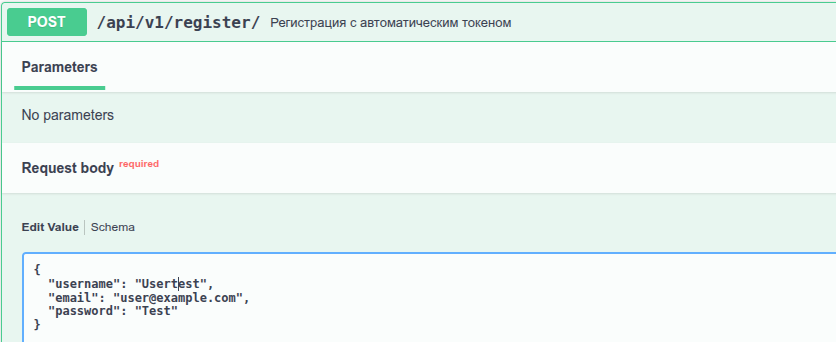
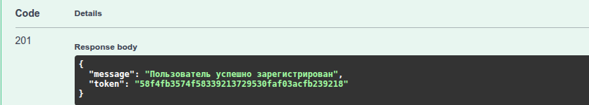

### *POSTMAN*
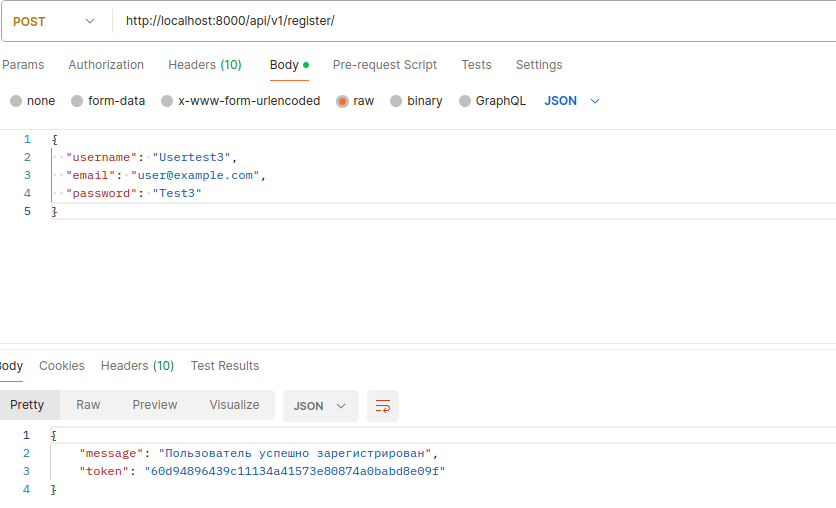

# 2. Авторизация нового пользователя:
### *SWAGGER*

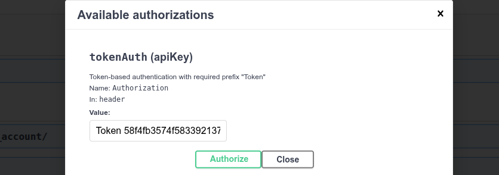

### *POSTMAN*
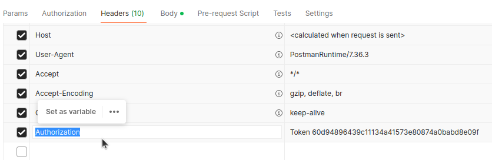

# 3. Проверка своего баланса (рубли):
### *SWAGGER*
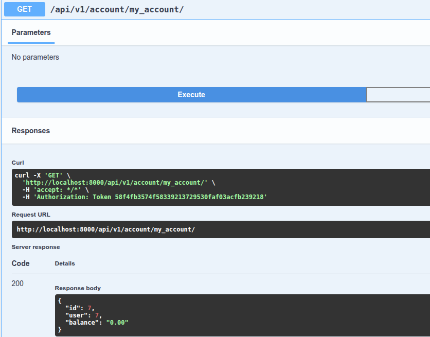

### *POSTMAN*
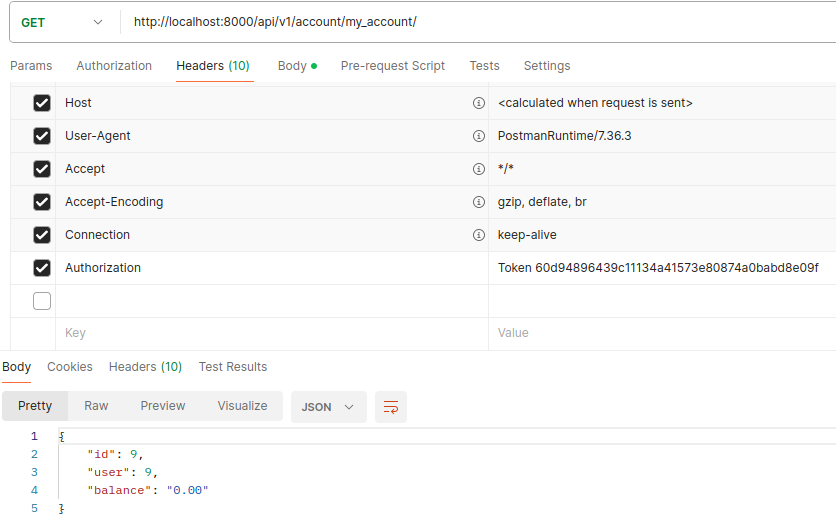

# 4. Пополнение своего баланса (в копейках):
### *SWAGGER*
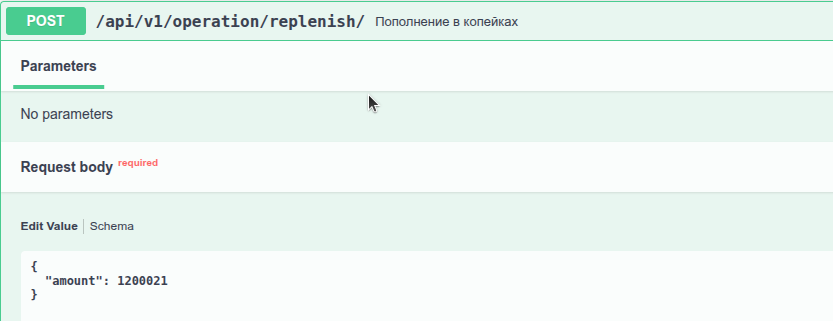

# 5. Результат пополнения (в рублях):
### *SWAGGER*
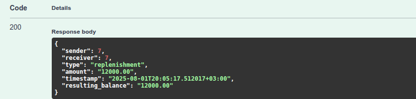

### *POSTMAN*
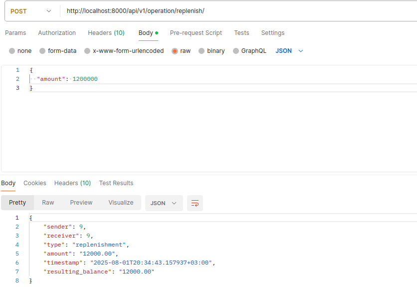

# 6. Регистрация и авторизация еще одного пользователя (по аналогии с 1 и 2). Пополнение баланса (в копейках):
### *SWAGGER*
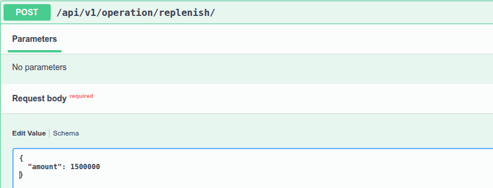

# 7. Результат пополнения (в рублях):
### *SWAGGER*
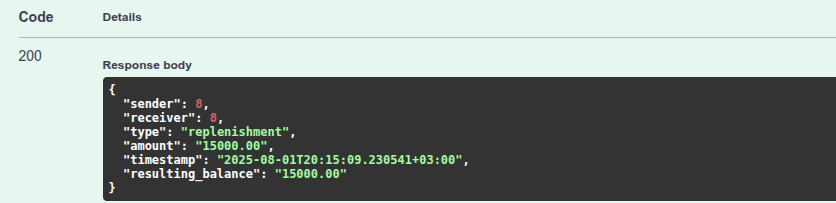

# 8. Перевод другому пользователю (в рублях):
### *SWAGGER*
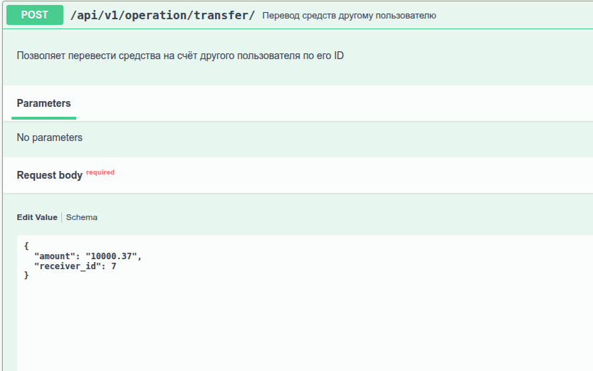

# 9. Результат перевода (в рублях):
### *SWAGGER*
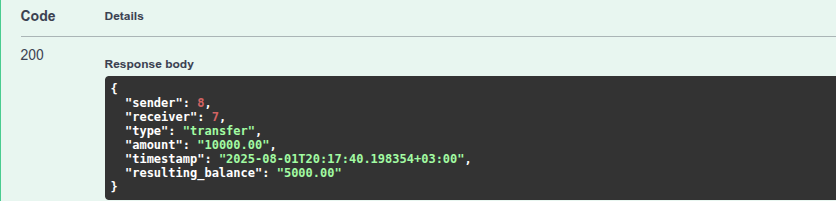

### *POSTMAN*
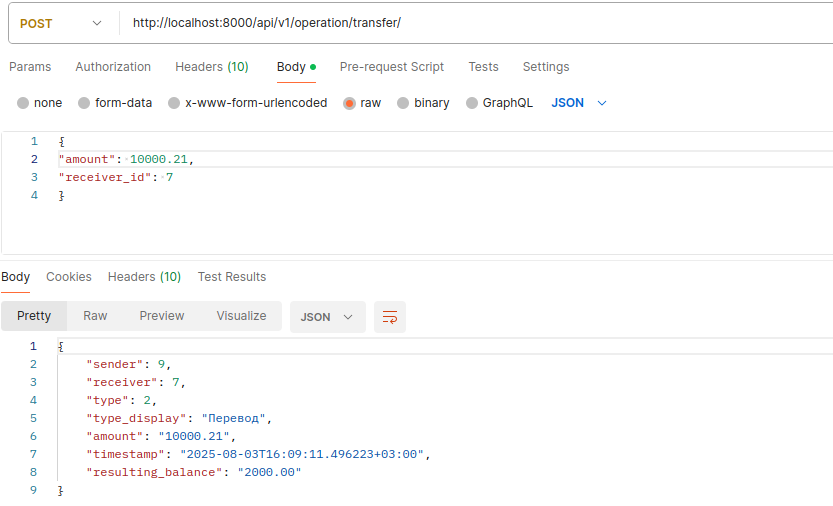

# 10. Просмотр текущего баланса (в рублях):
### *SWAGGER*
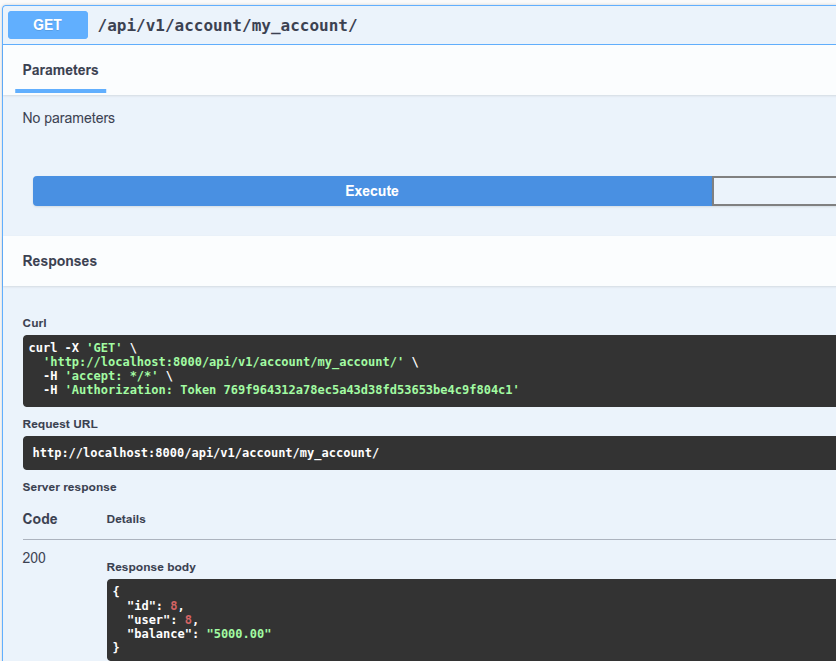

### *POSTMAN*
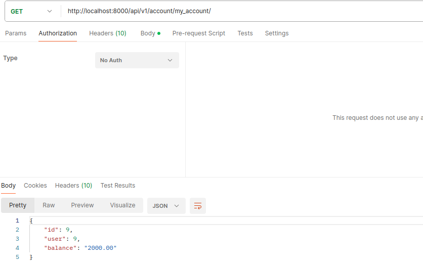

# 11. Просмотр всех операций текущего пользователя:
### *SWAGGER*
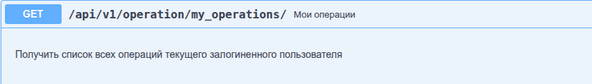
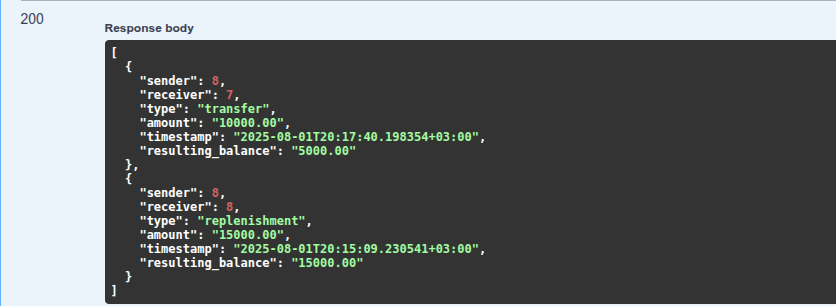

### *POSTMAN*
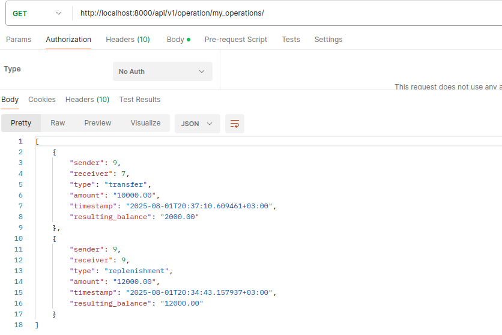

# 12. Перевод другому пользователю при недостаточности средств:
### *SWAGGER*
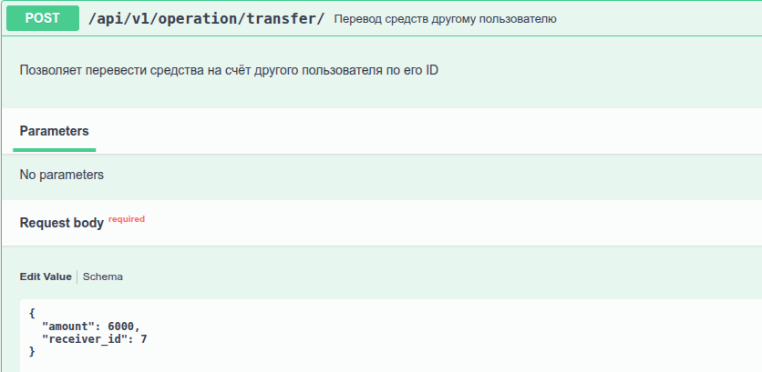
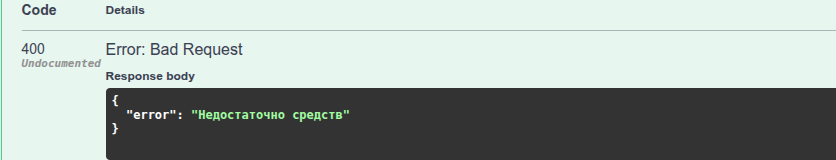
