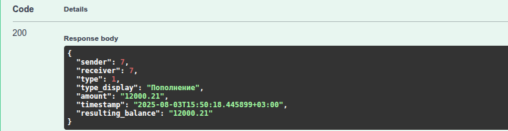
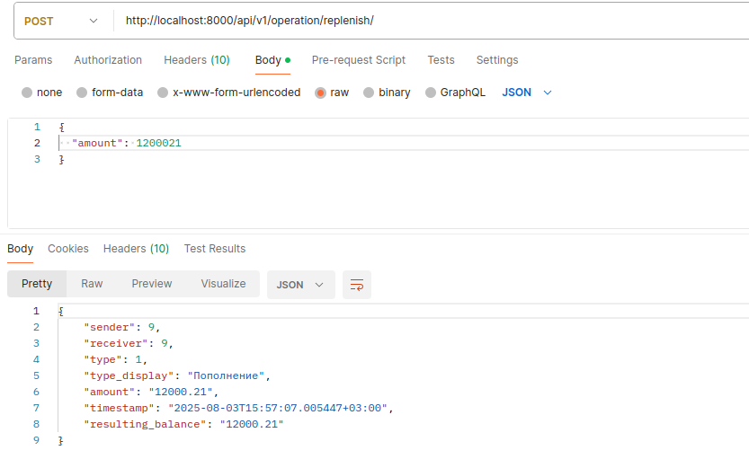
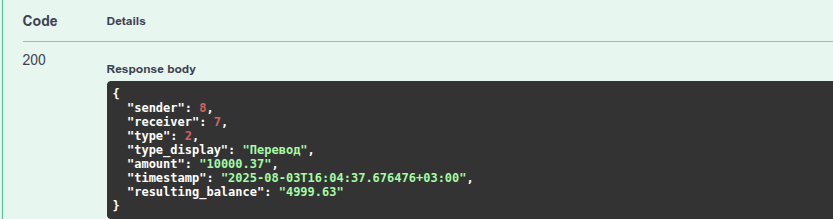
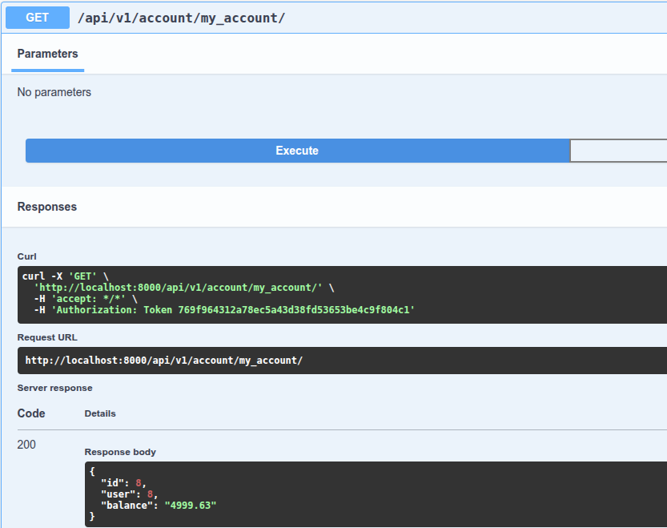
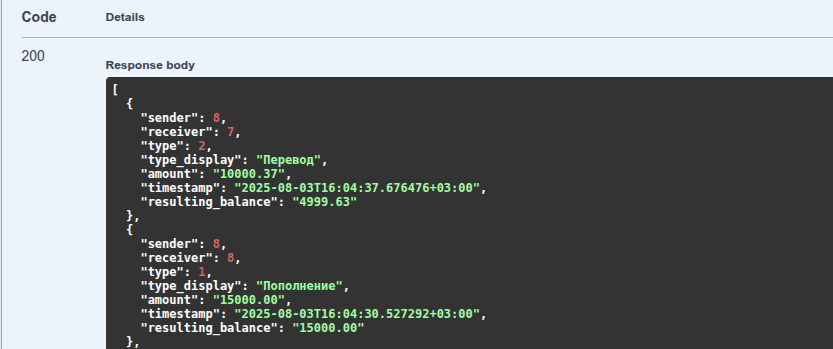
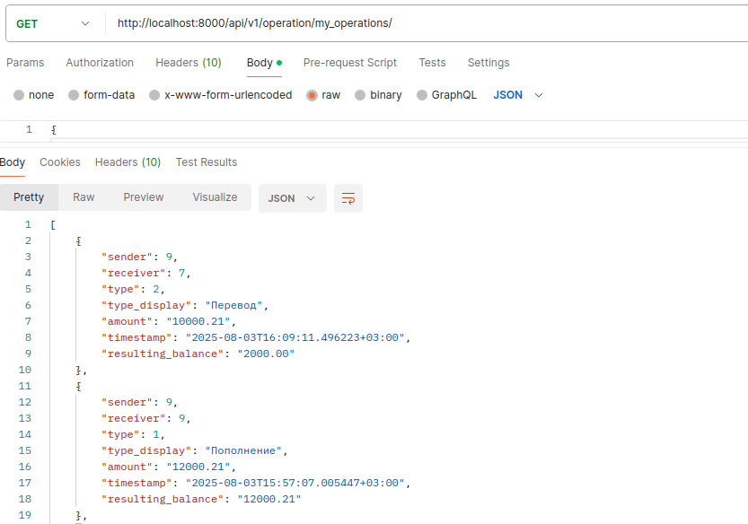

# Money Transaction API Project 2025

## Описание
API для пополнения баланса пользователя и перевода денег другому пользователю.

## Быстрый запуск с docker
```
git clone https://github.com/yourusername/money_transaction_2025.git
cd money_transaction_2025
cp example.env .env
docker-compose up --build
docker-compose exec web python manage.py migrate
docker-compose exec web python manage.py createsuperuser
```

## Документация
```
• Swagger: http://localhost:8000/swagger/
• Redoc: http://localhost:8000/redoc/
```

## Примеры использования
### 1. Регистрация нового пользователя с автоматическим получением токена и созданием нулевого баланса:

#### *SWAGGER*
http://localhost:8000/api/schema/swagger-ui/#/


#### *POSTMAN*


### 2. Авторизация нового пользователя:
#### *SWAGGER*


#### *POSTMAN*


### 3. Проверка своего баланса (рубли):
#### *SWAGGER*


#### *POSTMAN*


### 4. Пополнение своего баланса (в копейках):
#### *SWAGGER*


### 5. Результат пополнения (в рублях):
#### *SWAGGER*


#### *POSTMAN*


### 6. Регистрация и авторизация еще одного пользователя (по аналогии с 1 и 2). Пополнение баланса (в копейках):
#### *SWAGGER*


### 7. Результат пополнения (в рублях):
#### *SWAGGER*


### 8. Перевод другому пользователю (в рублях с копейками):
#### *SWAGGER*


### 9. Результат перевода (в рублях):
#### *SWAGGER*


#### *POSTMAN*


### 10. Просмотр текущего баланса (в рублях):
#### *SWAGGER*


#### *POSTMAN*


### 11. Просмотр всех операций текущего пользователя:
#### *SWAGGER*



#### *POSTMAN*


### 12. Перевод другому пользователю при недостаточности средств (пример обработки ошибки):
#### *SWAGGER*


